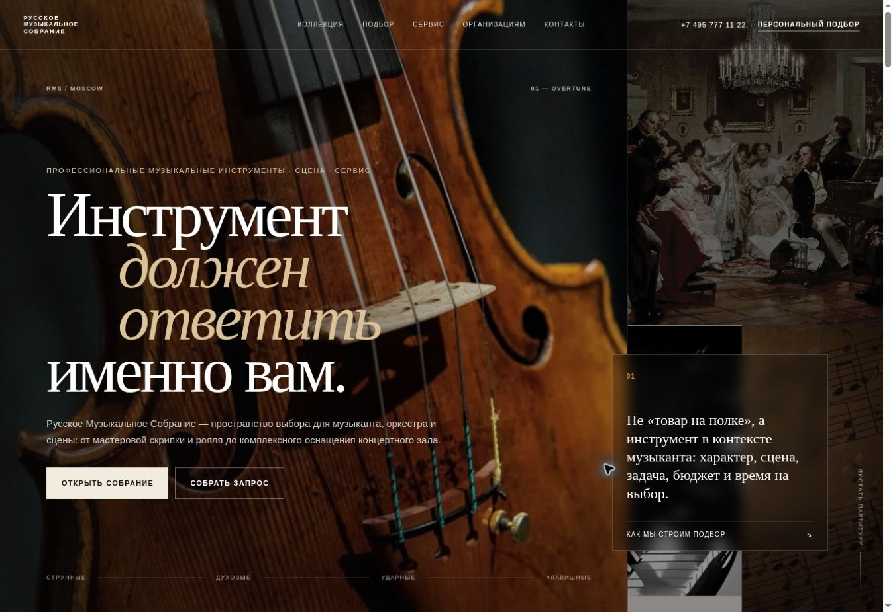

# Russian Music Assembly

An instrument showroom landing page with interactive collections and a request flow.



## Overview

An instrument showroom landing page with interactive collections and a request flow. The layout adapts to desktop and mobile screens.

## Features

- Filterable instrument collection and detail views
- Interactive selection scenarios and request dialog
- Pre-filled email request using a mailto link
- Responsive navigation and locally hosted hero imagery

## Tech Stack

- HTML5
- CSS3
- Vanilla JavaScript

## Project Structure

```text
├── index.html
├── assets/css/style.css
├── assets/js/app.js
├── assets/img/
├── docs/preview.png
└── README.md
```

## Live Demo

https://dayiawan.github.io/russian-music-assembly/

## Running Locally

Open `index.html` directly in a browser or serve the folder with `python3 -m http.server 8000` and open `http://localhost:8000/`.

## Notes

- Some collection thumbnails reference images on `ftcdn.net`; those views depend on that external host. The request action opens an email client through `mailto:` rather than submitting to an API.
